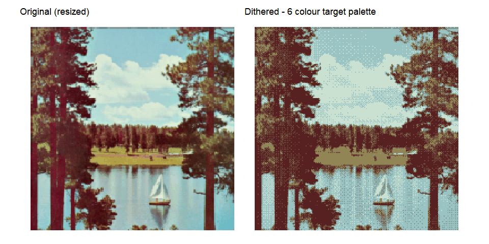
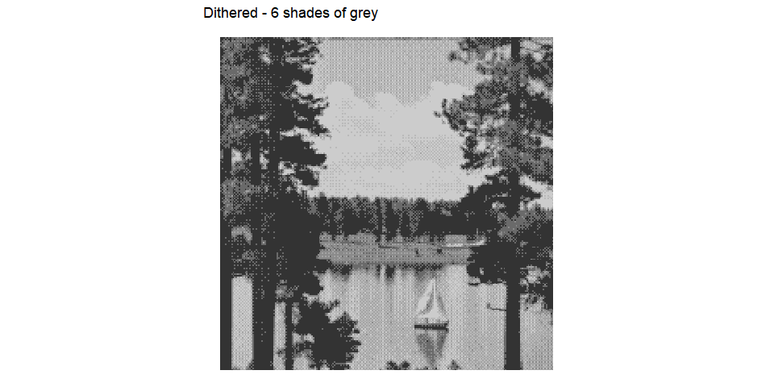

<!-- README.md is generated from README.Rmd. Please edit that file -->

# ditherer

The goal of ditherer is to implement a form of ordered imaging
dithering.

This is a very early work in progress.

## Installation

``` r
remotes::install_github('cj-holmes/ditherer)
```

## Example

``` r
library(ditherer)
library(ggplot2)
#> Warning: package 'ggplot2' was built under R version 3.6.3
```

Test image from [The USC-SIPI Image
Database](http://sipi.usc.edu/database/)

``` r
img <- 'data-raw/sailboat-on-lake.png'
patchwork::wrap_plots(dither(img, dither = FALSE, original = TRUE) + labs(title = "Original (resized)"),
                      dither(img, seed = 1) + labs(title = "Dithered - 6 colour target palette"))
```

<!-- -->

``` r
dither(img, target_palette = "greyscale") + labs(title = "Dithered - 6 shades of grey")
```

<!-- -->
