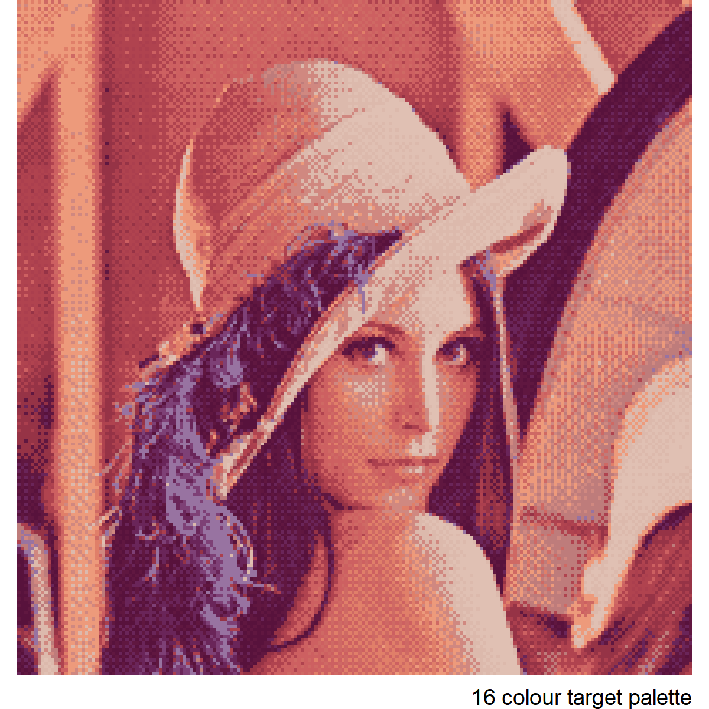
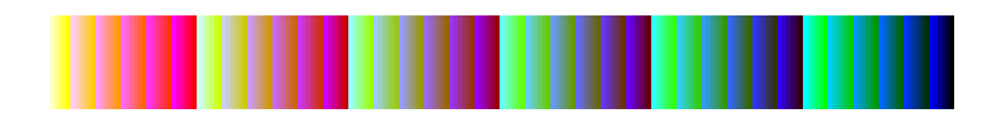
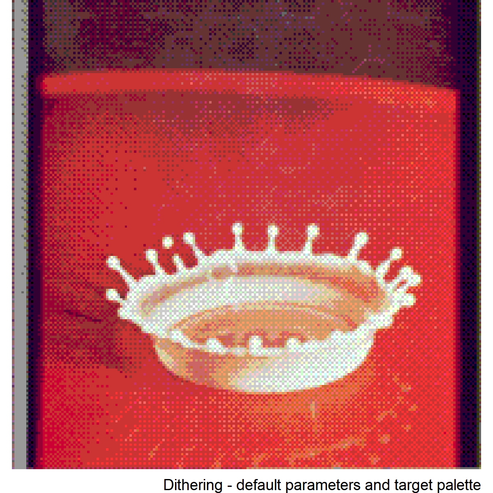

<!-- README.md is generated from README.Rmd. Please edit that file -->

# ditherer

This package makes an attempt at implementing full colour ordered (Bayer
matrix) dithering in R. The engine behind the image handling is the
`magick` package.

## Installation

``` r
remotes::install_github('cj-holmes/ditherer)
```

Add package to search path

``` r
library(ditherer)

# ggplot2 for convenience in readme
library(ggplot2)
```

## Typical workflow

Path to original image

``` r
img <- 'data-raw/lenna.png'
```

Create a target palette for the original image. Here I do that using the
`colorfindr` package.

``` r
# Create a 16 colour target palette from the image
set.seed(1)
tp <-
  colorfindr::get_colors(img) %>% 
  colorfindr::make_palette(n = 16, show = FALSE)

# View the target palette
data.frame(x = tp) %>%
  ggplot(aes(x="", fill = x))+
  geom_bar()+
  coord_flip()+
  scale_fill_identity()+
  theme_void()
```


Recreate the original image using only the target palette

``` r
# Original
dither(img, original = TRUE) + labs(caption="Original")

# Dithered (target palette)
dither(img, target_palette = tp) + labs(caption = "16 colour target palette")
```



## Default target palette

By default, if a target palette is not supplied, `ditherer` uses a
uniform palette made of 64 colours (in RGB steps of 85). This palette
does not perform well, but it does give a certain retro-gaming charm.

View the default palette

``` r
data.frame(x = ditherer::uniform_cols) %>% 
  ggplot(aes(x="", fill = x))+
  geom_bar()+
  coord_flip()+
  scale_fill_identity()+
  theme_void()
```



Varying the target palette colour spread `r` factor

``` r
dither(img, r=1/8) + labs(caption = "r = 1/8 (default)")
dither(img, r=1/6) + labs(caption = "r = 1/6")
dither(img, r=1/4) + labs(caption = "r = 1/4")
```


## Greyscale target palette

``` r
dither(img, target_palette = grey.colors(8))
```


## Other examples

### Splash

``` r
dither('http://sipi.usc.edu/database/preview/misc/4.2.01.png', original = TRUE) +
  labs(caption = "Original")
  
dither('http://sipi.usc.edu/database/preview/misc/4.2.01.png') +
  labs(caption = "Dithering - default parameters and target palette")
```



### Mandrill (a.k.a. Baboon)

``` r
dither('http://sipi.usc.edu/database/preview/misc/4.2.03.png', original = TRUE) +
  labs(caption = "Original")
  
dither('http://sipi.usc.edu/database/preview/misc/4.2.03.png', r=1/4) +
  labs(caption = "Dithering - default target palette")
```


