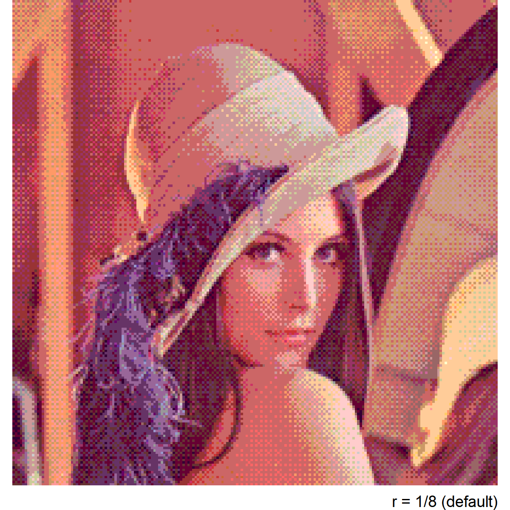

<!-- README.md is generated from README.Rmd. Please edit that file -->

# ditherer

This is a very early work in progress. EXPERIMENTAL\!

Now using `magick` as the main engine

## Installation

``` r
remotes::install_github('cj-holmes/ditherer)
```

``` r
library(ditherer)
```

## Test image

View the (resized) original image by setting `original = TRUE`

``` r
img <- 'data-raw/arnie.jpg'
dither(img, original = TRUE)
```

<!-- -->

## Ordered dithering (default)

Default settings are to extract a 16 colour target-palette from the
original (resized image).

``` r
dither(img, dither = "ordered")
```

<!-- -->

The number of colours in the extracted target palette can be set with
`n`.

``` r
dither(img, dither = "ordered", n=4)
```

<!-- -->

A greyscale target-palette of length `n` can be generated

``` r
dither(img, dither = "ordered", target_palette = "greyscale", n=10)
```

<!-- -->

A custom palette can be specified and will be used as is

``` r
dither(img, dither = "ordered", target_palette = c("black", "red3", "grey50", "tan2"))
```

<!-- -->

## Error diffusion dithering

Floyd/Steinberg error diffusion dithering (from the `magick` package)
can be specified

``` r
dither(img, dither = "diffusion")
```

<!-- -->
